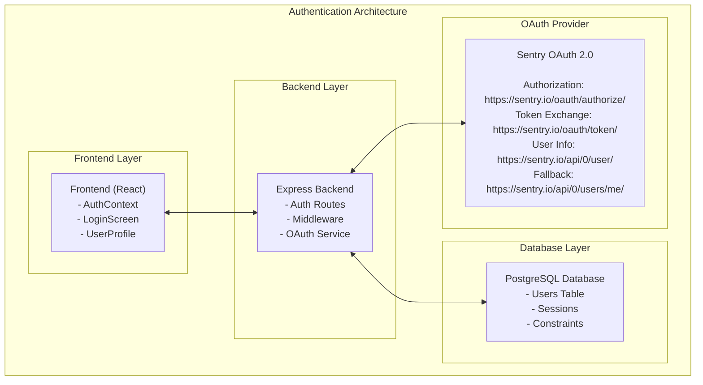
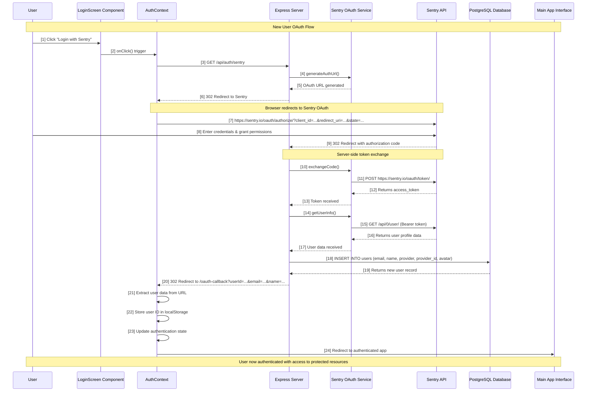
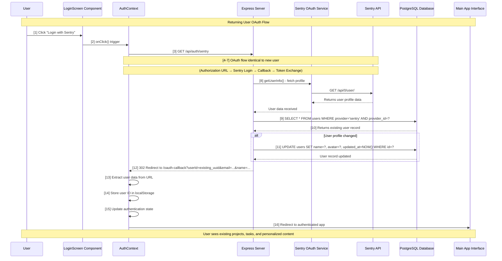
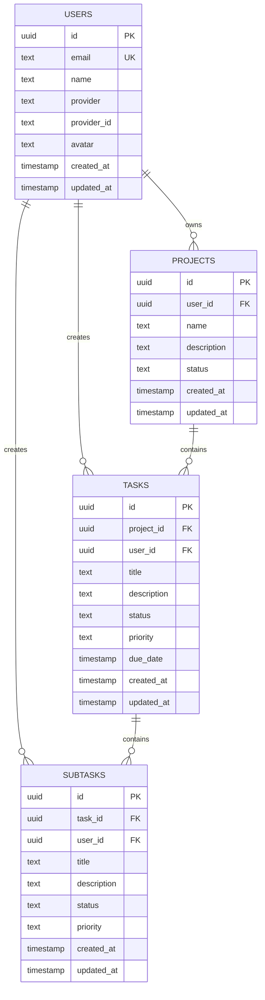
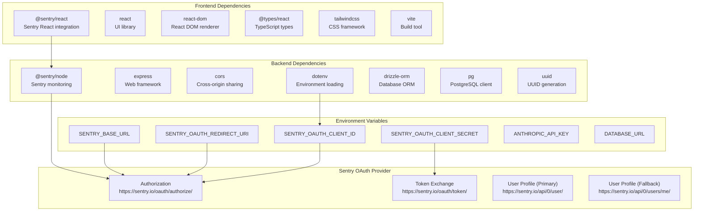
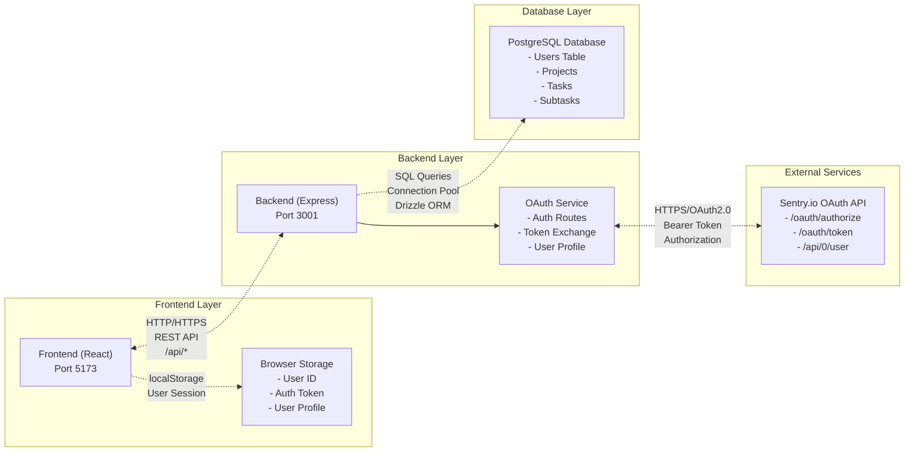
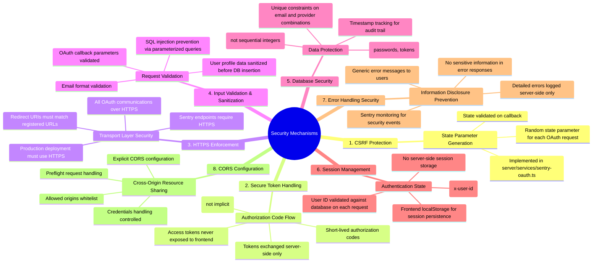

# OAuth Authentication Flow Documentation

## Table of Contents
1. [System Architecture Overview](#system-architecture-overview)
2. [New User Authentication Flow](#new-user-authentication-flow)
3. [Returning User Authentication Flow](#returning-user-authentication-flow)
4. [Database Schema & Relationships](#database-schema--relationships)
5. [System Dependencies](#system-dependencies)
6. [Error Handling Flows](#error-handling-flows)
7. [Security Mechanisms](#security-mechanisms)
8. [API Endpoints](#api-endpoints)

## System Architecture Overview

The authentication system implements a dual-provider architecture with Sentry OAuth as the primary provider and a fake/demo provider for development.



## New User Authentication Flow

### Step-by-Step Process for First-Time Users



### Database Operations for New Users

```sql
-- Step 9: New user creation
INSERT INTO users (
    id,                 -- Generated UUID
    email,              -- From Sentry profile
    name,               -- From Sentry profile  
    provider,           -- 'sentry'
    provider_id,        -- Sentry user ID
    avatar,             -- Sentry avatar URL
    created_at,         -- Current timestamp
    updated_at          -- Current timestamp
) VALUES (
    gen_random_uuid(),
    'user@example.com',
    'John Doe',
    'sentry',
    'sentry_user_123',
    'https://secure.gravatar.com/avatar/...',
    NOW(),
    NOW()
);
```

## Returning User Authentication Flow

### Step-by-Step Process for Existing Users



### Database Operations for Returning Users

```sql
-- Step 9: Check for existing user
SELECT id, email, name, provider, provider_id, avatar, created_at, updated_at
FROM users 
WHERE provider = 'sentry' 
AND provider_id = 'sentry_user_123';

-- Step 10: Update user data if profile changed
UPDATE users SET 
    name = 'Updated Name',
    avatar = 'https://new-avatar-url.com/avatar.jpg',
    updated_at = NOW()
WHERE provider = 'sentry' 
AND provider_id = 'sentry_user_123';
```

## Database Schema & Relationships

### Users Table Structure

```sql
CREATE TABLE "users" (
    "id" uuid PRIMARY KEY DEFAULT gen_random_uuid(),
    "email" text NOT NULL UNIQUE,
    "name" text NOT NULL,
    "provider" text,                    -- OAuth provider ('sentry', 'github', 'google', 'fake')
    "provider_id" text,                 -- Provider-specific user ID
    "avatar" text,                      -- Avatar URL from OAuth provider
    "created_at" timestamp DEFAULT now(),
    "updated_at" timestamp DEFAULT now()
);

-- Indexes for performance
CREATE INDEX idx_users_provider ON users(provider);
CREATE INDEX idx_users_provider_id ON users(provider_id);
CREATE UNIQUE INDEX idx_users_provider_composite ON users(provider, provider_id);
```

### Data Relationships



## System Dependencies

### OAuth Provider Dependencies



### Service Communication Flow



## Error Handling Flows

### OAuth Error Scenarios

```mermaid
flowchart TD
    subgraph "Error Scenario 1: Sentry API Unavailable"
        OS1[OAuth Service<br/>Token Exchange] -->|Request Fails| SA1[Sentry API<br/>Down/Error]
        SA1 -->|HTTP 500/Timeout| EH1[Error Handler]
        EH1 --> EH1A[Log error with Sentry monitoring]
        EH1 --> EH1B[Return user-friendly error message]
        EH1 --> EH1C[Redirect to login with error parameter]
    end
    
    subgraph "Error Scenario 2: Invalid Authorization Code"
        OCH2[OAuth Callback<br/>Handler] -->|Invalid Code| SA2[Sentry API<br/>Token Exchange]
        SA2 -->|HTTP 400 Bad Request| EH2[Error Handler]
        EH2 --> EH2A[Log invalid code attempt]
        EH2 --> EH2B[Clear any partial auth state]
        EH2 --> EH2C[Redirect to login with error]
    end
    
    subgraph "Error Scenario 3: Database Connection Error"
        AR3[Auth Route<br/>User Creation] -->|Query Fails| DB3[PostgreSQL<br/>Connection Error]
        DB3 -->|Connection Timeout| EH3[Error Handler]
        EH3 --> EH3A[Log database error]
        EH3 --> EH3B[Return 500 Internal Server Error]
        EH3 --> EH3C[Maintain OAuth token for retry]
    end
    
    subgraph "Error Scenario 4: User Profile Fetch Failure"
        OS4[OAuth Service<br/>getUserInfo] -->|Primary Fails| UP4[/api/0/user<br/>Primary]
        UP4 -->|HTTP 404/403| FL4[Fallback Logic]
        FL4 -->|Fallback Tries| UF4[/api/0/users/me<br/>Fallback]
        UF4 -->|Success/Failure| CH4[Continue/Error<br/>Handling]
        CH4 --> CH4A[Continue with user data or<br/>Log and return authentication error]
    end
    
    subgraph "Error Scenario 5: Frontend OAuth Callback Error"
        OCC5[OAuth Callback<br/>Component] -->|Missing Params| UP5[URL Parser<br/>No userId]
        UP5 -->|Invalid State| FEH5[Frontend Error<br/>Handler]
        FEH5 --> FEH5A[Show user-friendly error message]
        FEH5 --> FEH5B[Clear localStorage]
        FEH5 --> FEH5C[Redirect to login screen]
        FEH5 --> FEH5D[Log error to Sentry]
    end
```

## Security Mechanisms

### OAuth 2.0 Security Features



## API Endpoints

### Authentication Endpoints

| Method | Endpoint | Description | Authentication | Request Body | Response |
|--------|----------|-------------|----------------|--------------|-----------|
| `POST` | `/api/auth/fake-login` | Demo login for development | None | `{email: string, name: string}` | `{userId: string, email: string, name: string}` |
| `GET` | `/api/auth/me` | Get current user info | Required (`x-user-id`) | None | `{user: UserObject}` |
| `POST` | `/api/auth/logout` | Logout endpoint | Required (`x-user-id`) | None | `{message: "Logged out"}` |
| `GET` | `/api/auth/sentry` | Initiate Sentry OAuth | None | None | `302 Redirect to Sentry` |
| `GET` | `/api/auth/sentry/callback` | OAuth callback handler | None | Query: `code`, `state` | `302 Redirect to frontend` |

### Protected Resource Endpoints

| Method | Endpoint | Description | Authentication |
|--------|----------|-------------|----------------|
| `GET` | `/api/projects` | List user's projects | Required (`x-user-id`) |
| `POST` | `/api/projects` | Create new project | Required (`x-user-id`) |
| `GET` | `/api/projects/:id` | Get specific project | Required (`x-user-id`) |
| `PUT` | `/api/projects/:id` | Update project | Required (`x-user-id`) |
| `DELETE` | `/api/projects/:id` | Delete project | Required (`x-user-id`) |
| `POST` | `/api/chat` | AI chat interface | Required (`x-user-id`) |
| `POST` | `/api/ai/*` | AI tool endpoints | Required (`x-user-id`) |

### Frontend Routes

| Route | Component | Description | Authentication |
|-------|-----------|-------------|----------------|
| `/` | `App.tsx` | Main application | Required (redirects to login) |
| `/oauth-callback` | `AuthContext` | OAuth callback processor | None (processes auth) |
| `/login` (implicit) | `LoginScreen` | Login interface | None (shown when not authenticated) |

---

**Document Version**: 1.0  
**Last Updated**: 2025-01-22  
**Authors**: System Architecture Team  
**Review Status**: Ready for Security Review