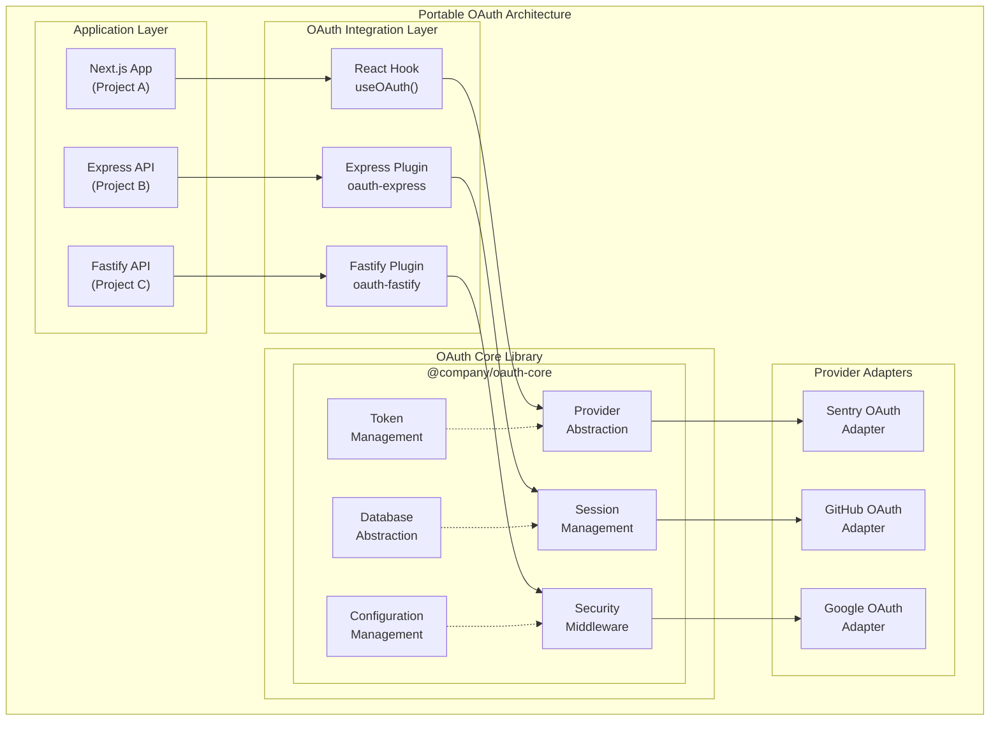

# OAuth Provider Portability Roadmap

## Executive Summary

This roadmap outlines the strategy to transform the current OAuth authentication system into a reusable, portable authentication library that can be easily integrated across multiple projects. The goal is to create a plug-and-play authentication solution that maintains security standards while providing flexibility for different application architectures.

## Table of Contents
1. [Current State Analysis](#current-state-analysis)
2. [Target Architecture](#target-architecture)
3. [Refactoring Strategy](#refactoring-strategy)
4. [Implementation Phases](#implementation-phases)
5. [Package Structure](#package-structure)
6. [Configuration System](#configuration-system)
7. [Integration Patterns](#integration-patterns)
8. [Testing & Validation](#testing--validation)
9. [Documentation Strategy](#documentation-strategy)
10. [Migration Path](#migration-path)

## Current State Analysis

### Existing Architecture Constraints

| Component | Current State | Portability Issues |
|-----------|---------------|-------------------|
| **OAuth Service** | Tightly coupled to Sentry | Hard-coded endpoints and logic |
| **Database Schema** | Project-specific | Assumes specific table structure |
| **Authentication Middleware** | Express-specific | Framework dependency |
| **Frontend Context** | React-specific | UI framework dependency |
| **Configuration** | Environment variables | No dynamic configuration |
| **Error Handling** | Sentry monitoring | Provider-specific error tracking |

### Dependencies Analysis

```typescript
// Current hard dependencies
{
  "framework": "express",          // Backend framework
  "ui": "react",                   // Frontend framework  
  "database": "postgresql",        // Database engine
  "orm": "drizzle-orm",           // ORM dependency
  "monitoring": "@sentry/node",    // Error tracking
  "oauth": "sentry-oauth"         // OAuth provider
}
```

## Target Architecture

### Modular Architecture Vision



### Design Principles

1. **Provider Agnostic**: Support multiple OAuth providers through adapters
2. **Framework Flexible**: Work with Express, Fastify, Next.js, etc.
3. **Database Agnostic**: Support PostgreSQL, MySQL, MongoDB, etc.
4. **Configuration Driven**: No hardcoded values, all configurable
5. **Security First**: Built-in security best practices
6. **Type Safe**: Full TypeScript support with strict typing
7. **Extensible**: Plugin architecture for custom functionality

## Refactoring Strategy

### Phase 1: Core Library Extraction

#### 1.1 Provider Abstraction Layer

```typescript
// Core interfaces for provider abstraction
interface OAuthProvider {
  name: string;
  generateAuthUrl(options: AuthUrlOptions): Promise<string>;
  exchangeCodeForToken(code: string, state: string): Promise<TokenResponse>;
  getUserProfile(token: string): Promise<UserProfile>;
  refreshToken?(refreshToken: string): Promise<TokenResponse>;
  revokeToken?(token: string): Promise<void>;
}

// Sentry provider implementation
export class SentryOAuthProvider implements OAuthProvider {
  name = 'sentry';
  
  constructor(private config: SentryOAuthConfig) {}
  
  async generateAuthUrl(options: AuthUrlOptions): Promise<string> {
    // Implementation using this.config
  }
  
  // ... other methods
}

// Provider factory
export class OAuthProviderFactory {
  static create(provider: string, config: any): OAuthProvider {
    switch (provider) {
      case 'sentry': return new SentryOAuthProvider(config);
      case 'github': return new GitHubOAuthProvider(config);
      case 'google': return new GoogleOAuthProvider(config);
      default: throw new Error(`Unsupported provider: ${provider}`);
    }
  }
}
```

#### 1.2 Database Abstraction Layer

```typescript
// Database interface
interface OAuthDatabase {
  createUser(userData: CreateUserData): Promise<User>;
  findUserByProvider(provider: string, providerId: string): Promise<User | null>;
  updateUser(userId: string, updates: Partial<User>): Promise<User>;
  deleteUser(userId: string): Promise<void>;
  createSession(sessionData: CreateSessionData): Promise<Session>;
  findSession(sessionId: string): Promise<Session | null>;
  deleteSession(sessionId: string): Promise<void>;
  cleanupExpiredSessions(): Promise<void>;
}

// Database adapter implementations
export class PostgreSQLOAuthDatabase implements OAuthDatabase {
  constructor(private connection: any, private schema?: string) {}
  // Implementation for PostgreSQL
}

export class MongoDBOAuthDatabase implements OAuthDatabase {
  constructor(private connection: any, private collection?: string) {}
  // Implementation for MongoDB
}
```

#### 1.3 Configuration Management

```typescript
// Configuration schema
interface OAuthConfig {
  providers: {
    [key: string]: {
      clientId: string;
      clientSecret: string;
      redirectUri: string;
      scopes?: string[];
      endpoints?: {
        authorization?: string;
        token?: string;
        userInfo?: string[];
      };
    };
  };
  security: {
    jwtSecret: string;
    tokenExpiry: string;
    refreshTokenExpiry: string;
    rateLimiting: RateLimitConfig;
    cors: CorsConfig;
  };
  database: {
    type: 'postgresql' | 'mysql' | 'mongodb' | 'sqlite';
    connection: string | object;
    schema?: string;
  };
  session: {
    storage: 'memory' | 'redis' | 'database';
    maxSessions: number;
    timeout: number;
  };
}

// Configuration loader
export class OAuthConfigLoader {
  static load(source: 'env' | 'file' | 'vault', options?: any): OAuthConfig {
    // Load configuration from various sources
  }
}
```

## Implementation Phases

### Phase 1: Foundation (Weeks 1-4)

**Objectives**: Extract core functionality into reusable modules

#### Week 1-2: Core Interfaces & Provider Abstraction
- [ ] Define core interfaces (`OAuthProvider`, `OAuthDatabase`, `OAuthConfig`)
- [ ] Create abstract base classes for providers
- [ ] Implement Sentry provider adapter
- [ ] Create provider factory pattern
- [ ] Write comprehensive unit tests

**Deliverables**:
- `@company/oauth-core` package structure
- Sentry provider adapter
- Type definitions
- Unit test suite (>90% coverage)

#### Week 3-4: Database & Session Abstraction
- [ ] Create database abstraction layer
- [ ] Implement PostgreSQL adapter
- [ ] Design session management system
- [ ] Create configuration management system
- [ ] Add integration tests

**Deliverables**:
- Database abstraction interfaces
- PostgreSQL adapter implementation
- Session management module
- Configuration loader
- Integration test suite

### Phase 2: Framework Integration (Weeks 5-8)

**Objectives**: Create framework-specific integrations

#### Week 5-6: Express Integration
- [ ] Extract Express middleware to separate package
- [ ] Create Express plugin with route generation
- [ ] Implement Express-specific error handling
- [ ] Add Express authentication guards
- [ ] Create Express starter template

**Deliverables**:
- `@company/oauth-express` package
- Express middleware and routes
- Express integration documentation
- Starter template project

#### Week 7-8: React Integration
- [ ] Create React hooks for OAuth
- [ ] Build React context providers
- [ ] Implement React components (login, profile, etc.)
- [ ] Add React Router integration
- [ ] Create React starter template

**Deliverables**:
- `@company/oauth-react` package
- React hooks and components
- React integration documentation
- Starter template project

### Phase 3: Additional Providers (Weeks 9-12)

**Objectives**: Expand provider support and add advanced features

#### Week 9-10: GitHub & Google Providers
- [ ] Implement GitHub OAuth provider
- [ ] Implement Google OAuth provider
- [ ] Add provider-specific configuration
- [ ] Create provider comparison documentation
- [ ] Add provider switching capabilities

#### Week 11-12: Advanced Features
- [ ] Multi-factor authentication support
- [ ] Social login aggregation
- [ ] Advanced session management
- [ ] Audit logging framework
- [ ] Performance monitoring hooks

### Phase 4: Production Readiness (Weeks 13-16)

**Objectives**: Production deployment and monitoring

#### Week 13-14: Security & Performance
- [ ] Security audit and penetration testing
- [ ] Performance optimization and benchmarking
- [ ] Load testing with different configurations
- [ ] Security documentation and best practices
- [ ] Compliance verification (GDPR, SOC2)

#### Week 15-16: Documentation & Deployment
- [ ] Complete API documentation
- [ ] Migration guides from existing implementations
- [ ] Deployment guides for different platforms
- [ ] Monitoring and alerting setup
- [ ] Community support documentation

## Package Structure

### Core Library Structure

```
@company/oauth-core/
├── src/
│   ├── providers/
│   │   ├── base/
│   │   │   ├── OAuthProvider.ts
│   │   │   └── ProviderError.ts
│   │   ├── sentry/
│   │   │   ├── SentryProvider.ts
│   │   │   └── SentryConfig.ts
│   │   ├── github/
│   │   │   ├── GitHubProvider.ts
│   │   │   └── GitHubConfig.ts
│   │   └── index.ts
│   ├── database/
│   │   ├── interfaces/
│   │   │   └── OAuthDatabase.ts
│   │   ├── adapters/
│   │   │   ├── PostgreSQLAdapter.ts
│   │   │   ├── MongoDBAdapter.ts
│   │   │   └── SQLiteAdapter.ts
│   │   └── index.ts
│   ├── security/
│   │   ├── TokenManager.ts
│   │   ├── SessionManager.ts
│   │   ├── RateLimiter.ts
│   │   └── CSRFProtection.ts
│   ├── config/
│   │   ├── ConfigLoader.ts
│   │   ├── ConfigValidator.ts
│   │   └── DefaultConfig.ts
│   ├── utils/
│   │   ├── Logger.ts
│   │   ├── Crypto.ts
│   │   └── Validators.ts
│   └── index.ts
├── tests/
│   ├── unit/
│   ├── integration/
│   └── fixtures/
├── docs/
├── examples/
└── package.json
```

### Framework Integration Packages

```
@company/oauth-express/
├── src/
│   ├── middleware/
│   │   ├── AuthMiddleware.ts
│   │   ├── RateLimitMiddleware.ts
│   │   └── CSRFMiddleware.ts
│   ├── routes/
│   │   ├── AuthRoutes.ts
│   │   └── CallbackRoutes.ts
│   ├── plugins/
│   │   └── ExpressOAuthPlugin.ts
│   └── index.ts

@company/oauth-react/
├── src/
│   ├── hooks/
│   │   ├── useOAuth.ts
│   │   ├── useUser.ts
│   │   └── useSession.ts
│   ├── components/
│   │   ├── LoginButton.tsx
│   │   ├── UserProfile.tsx
│   │   ├── ProtectedRoute.tsx
│   │   └── OAuthCallback.tsx
│   ├── contexts/
│   │   └── OAuthContext.tsx
│   └── index.ts
```

## Configuration System

### Multi-Environment Configuration

```typescript
// Development configuration
const devConfig: OAuthConfig = {
  providers: {
    sentry: {
      clientId: process.env.SENTRY_CLIENT_ID!,
      clientSecret: process.env.SENTRY_CLIENT_SECRET!,
      redirectUri: 'http://localhost:3001/auth/sentry/callback'
    }
  },
  security: {
    jwtSecret: 'dev-secret',
    tokenExpiry: '1h',
    rateLimiting: {
      enabled: false
    }
  },
  database: {
    type: 'sqlite',
    connection: ':memory:'
  }
};

// Production configuration
const prodConfig: OAuthConfig = {
  providers: {
    sentry: {
      clientId: '${SENTRY_CLIENT_ID}',
      clientSecret: '${SENTRY_CLIENT_SECRET}', 
      redirectUri: '${BASE_URL}/auth/sentry/callback'
    },
    github: {
      clientId: '${GITHUB_CLIENT_ID}',
      clientSecret: '${GITHUB_CLIENT_SECRET}',
      redirectUri: '${BASE_URL}/auth/github/callback'
    }
  },
  security: {
    jwtSecret: '${JWT_SECRET}',
    tokenExpiry: '15m',
    refreshTokenExpiry: '30d',
    rateLimiting: {
      enabled: true,
      windowMs: 900000, // 15 minutes
      max: 100
    }
  },
  database: {
    type: 'postgresql',
    connection: '${DATABASE_URL}'
  }
};
```

### Dynamic Configuration Loading

```typescript
// Configuration with dynamic loading
export class OAuthConfigManager {
  private config: OAuthConfig;
  private watchers: Array<() => void> = [];

  constructor(source: ConfigSource) {
    this.loadConfig(source);
    this.setupConfigWatcher(source);
  }

  private async loadConfig(source: ConfigSource): Promise<void> {
    switch (source.type) {
      case 'environment':
        this.config = this.loadFromEnvironment();
        break;
      case 'vault':
        this.config = await this.loadFromVault(source.options);
        break;
      case 'kubernetes':
        this.config = await this.loadFromK8sSecrets(source.options);
        break;
    }
  }

  onChange(callback: () => void): void {
    this.watchers.push(callback);
  }

  private notifyWatchers(): void {
    this.watchers.forEach(callback => callback());
  }
}
```

## Integration Patterns

### Express.js Integration

```typescript
// Simple Express integration
import express from 'express';
import { createOAuthRouter, OAuthConfig } from '@company/oauth-express';

const app = express();
const config: OAuthConfig = {
  providers: {
    sentry: {
      clientId: process.env.SENTRY_CLIENT_ID,
      clientSecret: process.env.SENTRY_CLIENT_SECRET,
      redirectUri: 'http://localhost:3001/auth/sentry/callback'
    }
  }
};

// Add OAuth routes
app.use('/auth', createOAuthRouter(config));

// Protected route example
app.get('/api/profile', requireAuth, (req, res) => {
  res.json({ user: req.user });
});
```

### React Integration

```typescript
// React application setup
import React from 'react';
import { OAuthProvider, useOAuth } from '@company/oauth-react';

function App() {
  return (
    <OAuthProvider 
      config={{
        apiUrl: 'http://localhost:3001',
        providers: ['sentry', 'github']
      }}
    >
      <AuthenticatedApp />
    </OAuthProvider>
  );
}

function AuthenticatedApp() {
  const { user, login, logout, isLoading } = useOAuth();

  if (isLoading) return <div>Loading...</div>;
  
  if (!user) {
    return (
      <div>
        <button onClick={() => login('sentry')}>Login with Sentry</button>
        <button onClick={() => login('github')}>Login with GitHub</button>
      </div>
    );
  }

  return (
    <div>
      <h1>Welcome, {user.name}!</h1>
      <button onClick={logout}>Logout</button>
    </div>
  );
}
```

### Next.js Integration

```typescript
// Next.js API routes integration
// pages/api/auth/[...oauth].ts
import { createOAuthHandler } from '@company/oauth-nextjs';

const config = {
  providers: {
    sentry: {
      clientId: process.env.SENTRY_CLIENT_ID,
      clientSecret: process.env.SENTRY_CLIENT_SECRET
    }
  }
};

export default createOAuthHandler(config);

// pages/_app.tsx
import { OAuthProvider } from '@company/oauth-react';

function MyApp({ Component, pageProps }) {
  return (
    <OAuthProvider apiUrl="/api/auth">
      <Component {...pageProps} />
    </OAuthProvider>
  );
}
```

## Testing & Validation

### Testing Strategy

```typescript
// Unit testing example
describe('SentryOAuthProvider', () => {
  let provider: SentryOAuthProvider;
  let mockConfig: SentryOAuthConfig;

  beforeEach(() => {
    mockConfig = {
      clientId: 'test-client-id',
      clientSecret: 'test-client-secret',
      redirectUri: 'http://localhost:3001/callback'
    };
    provider = new SentryOAuthProvider(mockConfig);
  });

  describe('generateAuthUrl', () => {
    it('should generate valid authorization URL', async () => {
      const url = await provider.generateAuthUrl({
        state: 'test-state',
        scopes: ['read:user']
      });
      
      expect(url).toContain('https://sentry.io/oauth/authorize');
      expect(url).toContain('client_id=test-client-id');
      expect(url).toContain('state=test-state');
    });
  });
});

// Integration testing
describe('OAuth Integration', () => {
  let testApp: TestApplication;
  let testDb: TestDatabase;

  beforeAll(async () => {
    testDb = await createTestDatabase();
    testApp = await createTestApplication(testDb);
  });

  it('should complete full OAuth flow', async () => {
    // Test full OAuth flow end-to-end
    const authUrl = await testApp.getAuthUrl('sentry');
    const callback = await mockOAuthCallback(authUrl);
    const user = await testApp.processCallback(callback);
    
    expect(user).toBeDefined();
    expect(user.provider).toBe('sentry');
  });
});
```

### Validation Framework

```typescript
// Configuration validation
export const configSchema = z.object({
  providers: z.record(z.object({
    clientId: z.string().min(1),
    clientSecret: z.string().min(1),
    redirectUri: z.string().url(),
    scopes: z.array(z.string()).optional()
  })),
  security: z.object({
    jwtSecret: z.string().min(32),
    tokenExpiry: z.string(),
    rateLimiting: z.object({
      enabled: z.boolean(),
      windowMs: z.number().positive().optional(),
      max: z.number().positive().optional()
    })
  })
});

// Runtime validation
export function validateConfig(config: unknown): OAuthConfig {
  try {
    return configSchema.parse(config);
  } catch (error) {
    throw new ConfigurationError('Invalid OAuth configuration', { error });
  }
}
```

## Documentation Strategy

### Documentation Structure

```
docs/
├── getting-started/
│   ├── installation.md
│   ├── quick-start.md
│   └── basic-configuration.md
├── guides/
│   ├── express-integration.md
│   ├── react-integration.md
│   ├── nextjs-integration.md
│   ├── provider-setup/
│   │   ├── sentry.md
│   │   ├── github.md
│   │   └── google.md
│   └── advanced/
│       ├── custom-providers.md
│       ├── security-configuration.md
│       └── performance-tuning.md
├── api-reference/
│   ├── core/
│   ├── express/
│   └── react/
├── examples/
│   ├── basic-express/
│   ├── react-spa/
│   ├── nextjs-fullstack/
│   └── multi-provider/
└── migration/
    ├── from-passport.md
    ├── from-auth0.md
    └── from-current-implementation.md
```

### Example Documentation

```markdown
# Quick Start Guide

## Installation

```bash
npm install @company/oauth-core @company/oauth-express @company/oauth-react
```

## Express Setup

```typescript
import express from 'express';
import { createOAuthRouter } from '@company/oauth-express';

const app = express();

app.use('/auth', createOAuthRouter({
  providers: {
    sentry: {
      clientId: process.env.SENTRY_CLIENT_ID,
      clientSecret: process.env.SENTRY_CLIENT_SECRET,
      redirectUri: process.env.SENTRY_REDIRECT_URI
    }
  }
}));
```

## React Setup

```typescript
import { OAuthProvider, LoginButton } from '@company/oauth-react';

function App() {
  return (
    <OAuthProvider apiUrl="http://localhost:3001">
      <LoginButton provider="sentry">Login with Sentry</LoginButton>
    </OAuthProvider>
  );
}
```
```

## Migration Path

### Migration Strategy

#### Phase 1: Parallel Implementation
- Install new OAuth packages alongside existing implementation
- Create feature flags to switch between old and new systems
- Implement new OAuth for new features only
- Run both systems in parallel for testing

#### Phase 2: Gradual Migration
- Migrate authentication routes one by one
- Update frontend components to use new hooks
- Migrate user sessions to new format
- Preserve existing user data and sessions

#### Phase 3: Complete Cutover
- Remove old OAuth implementation
- Clean up legacy code and dependencies
- Update documentation and deployment scripts
- Monitor for any issues post-migration

### Migration Checklist

```typescript
// Migration helper utilities
export class OAuthMigrator {
  async migrateUserSessions(
    oldDatabase: any, 
    newDatabase: OAuthDatabase
  ): Promise<MigrationResult> {
    // Migrate existing user sessions to new format
  }

  async validateMigration(): Promise<ValidationResult> {
    // Validate that migration was successful
  }

  async rollback(): Promise<void> {
    // Rollback migration if issues are found
  }
}
```

## Success Metrics

### Implementation Success Criteria

| Metric | Target | Measurement |
|--------|---------|------------|
| **Package Size** | < 100KB (core) | Bundle analyzer |
| **Setup Time** | < 30 minutes | Developer survey |
| **Configuration LOC** | < 50 lines | Code analysis |
| **Test Coverage** | > 95% | Jest coverage |
| **Documentation Coverage** | 100% API coverage | Doc generator |
| **Integration Time** | < 2 hours | Time tracking |

### Adoption Metrics

| Metric | 3 Months | 6 Months | 12 Months |
|--------|----------|----------|-----------|
| **Internal Projects** | 3 | 8 | 15 |
| **External Users** | 10 | 50 | 200 |
| **GitHub Stars** | 25 | 100 | 500 |
| **NPM Downloads** | 100/week | 500/week | 2000/week |

## Risk Mitigation

### Technical Risks

| Risk | Impact | Probability | Mitigation |
|------|--------|-------------|------------|
| **Breaking API Changes** | High | Medium | Semantic versioning, deprecation notices |
| **Security Vulnerabilities** | Critical | Low | Security audits, automated scanning |
| **Performance Regression** | Medium | Medium | Benchmarking, performance tests |
| **Framework Incompatibility** | High | Low | Comprehensive testing, adapter pattern |

### Business Risks

| Risk | Impact | Probability | Mitigation |
|------|--------|-------------|------------|
| **Adoption Resistance** | Medium | Medium | Training, documentation, support |
| **Maintenance Overhead** | Medium | High | Automated testing, CI/CD, community |
| **Competitive Solutions** | Low | High | Unique features, excellent DX |

## Conclusion

This roadmap provides a comprehensive strategy for transforming the current OAuth implementation into a portable, reusable authentication library. The phased approach ensures minimal disruption to existing projects while building a robust foundation for future applications.

**Key Success Factors**:
1. **Developer Experience First**: Easy setup, clear documentation, minimal configuration
2. **Security by Default**: Built-in security best practices, regular audits
3. **Framework Agnostic**: Support for multiple frameworks and architectures
4. **Community Driven**: Open source approach with community contributions
5. **Enterprise Ready**: Production-tested, scalable, maintainable

**Next Steps**:
1. Approve roadmap and allocate resources
2. Set up development environment and CI/CD pipelines
3. Begin Phase 1 implementation
4. Establish community channels and contribution guidelines

---

**Document Version**: 1.0  
**Estimated Timeline**: 16 weeks  
**Resource Requirements**: 2-3 senior developers, 1 technical writer  
**Budget Estimate**: $200,000 - $300,000